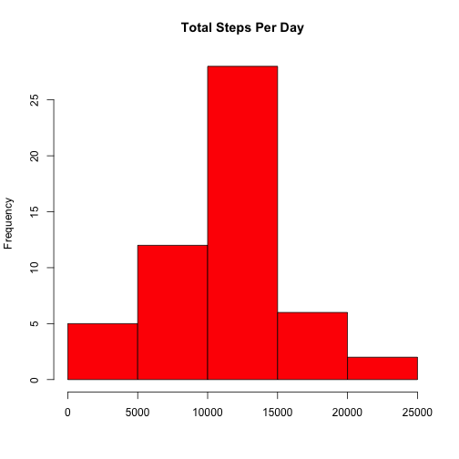
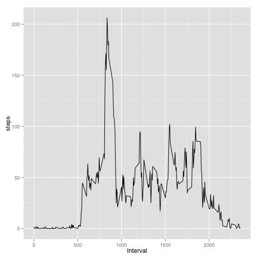
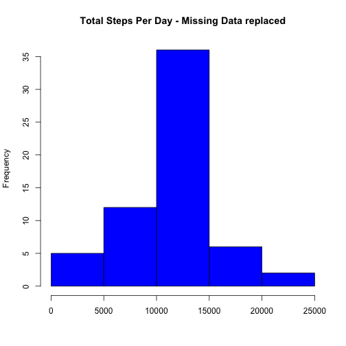
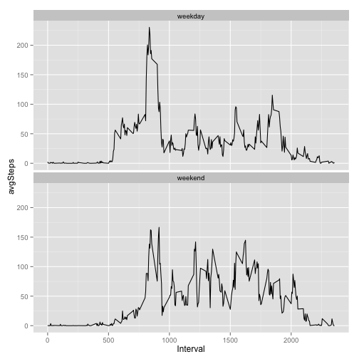

# Reproducible Research: Peer Assessment 1


###Loading and preprocessing the data
First, download and extract the data locally.  Assign the complete file path to the variable 'destfile'.  Now, load and preprocess the data

```r
#load and preprocess the data
data <- read.csv(destfile, header = TRUE, na.strings = 'NA', stringsAsFactors = FALSE)

#transform the date column from character to date type
data$date <- as.Date(data$date, format = '%Y-%m-%d')
```


###What is mean total number of steps taken per day?
This requires first calculating the total number of steps per day

```r
#calculate the total number of steps per day
totalStepsPerDay <- aggregate(data$steps, by = list(Day = data$date), FUN = sum)
colnames(totalStepsPerDay) <- c('Day', 'steps')
```

With this, explore the data a bit by plotting a histogram of the total steps per day.

```r
#plot a histogram of the total steps per day
hist(totalStepsPerDay$steps, main = 'Total Steps Per Day',
     xlab = '', col = 'red')
```

 

```r
#calculate the mean and median of the total number of steps per day
stepsMean = mean(totalStepsPerDay$steps, na.rm = TRUE)
stepsMedian = median(totalStepsPerDay$steps, na.rm = TRUE)
```

Then calculate some descriptive statistics:<br>
The mean of the total number of steps per day is 1.0766 &times; 10<sup>4</sup>. <br>
The median of the total number of steps per day is 10765.


###What is the average daily activity pattern?
Let's calculate the average number of steps per five-minute interval, then plot the results in a line graph.

```r
#calculate the average number of steps per 5-minute interval
avgStepsPerInterval <- aggregate(data$steps, by = list(Interval = data$interval),
                                 FUN = mean, na.rm = TRUE)
colnames(avgStepsPerInterval)[2] <- c('steps')

#plot a line graph with those average numbers
g <- ggplot(avgStepsPerInterval, aes(Interval, steps))
g <- g + geom_line()
print(g)
```

 


```r
#determine which time interval has the max number of steps
intervalAvgMaxSteps <- avgStepsPerInterval$Interval[avgStepsPerInterval$steps == max(avgStepsPerInterval$steps)]
maxAvgSteps <- max(avgStepsPerInterval$steps)
```

Note that the five-minute interval with the largest average is interval 835 with 206.1698 steps.

###Inputing missing values
There are several missing values in the data.  We need to determine how many and devise a strategy for dealing with them.

```r
#Determine the total number of missing values
countNAs <- sum(is.na(data$steps))
```

There are 2304 missing values are in the 'steps' column of the data.

This number is not huge, but enough to do something about.  As a strategy, these missing values will be replaced by the mean of the corresponding five-minute interval.

```r
#where the steps value is missing, assign the mean of the
#corresponding 5-minute interval to that step value
newsteps <- 0
count <- 0
for (i in 1:length(data$steps)) {
    if (is.na(data$steps[i])) {
        count <- count + 1
        newsteps[i] <- avgStepsPerInterval$steps[avgStepsPerInterval$Interval == data$interval[i]]
    }
    else {
        newsteps[i] <- data$steps[i]
    }
}

#create a new dataset with the missing values filled in, but
#otherwise equal to the original dataset
newdata <- cbind(newsteps, data[,2-3])
```

Now, we recalculate the totals, ... 

```r
#calculate the new total number of steps per day
newTotalStepsPerDay <- aggregate(newdata$newsteps,
                                 by = list(Day = newdata$date), FUN = sum)
colnames(newTotalStepsPerDay)[2] <- c('newsteps')
```

plot a new histogram, ...


```r
#plot a histogram of the new total steps per day
hist(newTotalStepsPerDay$newsteps, main = 'Total Steps Per Day - Missing Data replaced',
     xlab = '', col = 'blue')
```

 

```r
#calculate the mean and median of the new total number of steps per day
newStepsMean = mean(newTotalStepsPerDay$newsteps, na.rm = TRUE)
newStepsMedian = median(newTotalStepsPerDay$newsteps, na.rm = TRUE)
```

and recalculate new descriptive statistics:<br>
The new mean of the total number of steps per day is 1.0766 &times; 10<sup>4</sup>. <br>
The new median of the total number of steps per day is 1.0766 &times; 10<sup>4</sup>.<br>

Comparing the old and the new, the impact of replacing the missing values is to make the data closer to a normal disribution with less skew in the population and the new mean equalling the new median.


###Are there differences in activity patterns between weekdays and weekends?
In order to compare patterns between weekdays and weekends, let's append a factor variable to the new data with the values of either 'weekday' or 'weekend'.

```r
#create and append the weekend/weekday factor variable to the newdata data.frame
newdata$Day <- ifelse(weekdays(newdata$date) == 'Sunday' | weekdays(newdata$date) == 'Saturday',
                      'weekend', 'weekday')
newdata$Day <- as.factor(newdata$Day)
```
Then we calculate the average steps per day based on that new factor and the five-minute interval and plot the results.

```r
avgStepsPerDayInterval <- aggregate(newdata$newsteps,
                                    by = list(Day = newdata$Day, Interval = newdata$interval),
                                    FUN = mean, na.rm = TRUE)
colnames(avgStepsPerDayInterval)[3] <- c('avgSteps')

#plot the weekday and weekend steps per day by interval
h <- ggplot(avgStepsPerDayInterval, aes(Interval, avgSteps))
h <- h + geom_line() + facet_wrap(~ Day, nrow = 2)
print(h)
```

 
